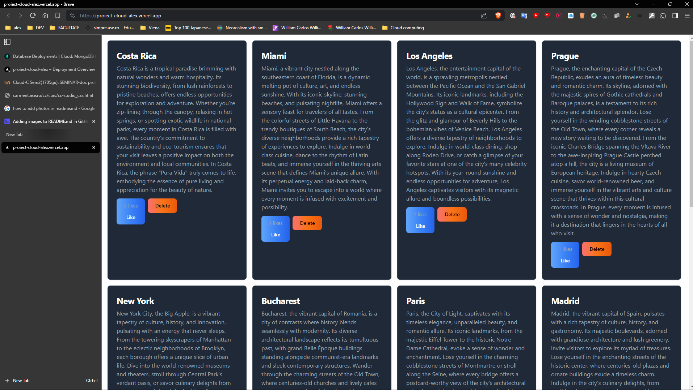
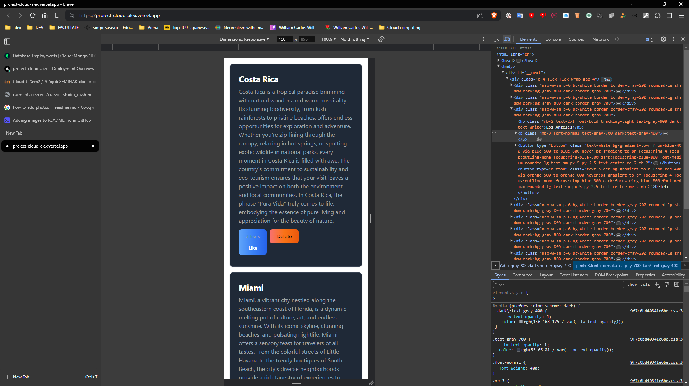

Proiect Cloud Computing

1. Introducere
În era digitală în care ne aflăm, tehnologiile cloud au devenit fundamentale pentru întreprinderi și indivizi deopotrivă. Odată cu evoluția rapidă a tehnologiei informației, conceptul de cloud computing a devenit un pilon esențial al infrastructurii IT, transformând modul în care stocăm, accesăm și procesăm datele.
Cloud computing-ul poate fi definit ca un model de furnizare a serviciilor IT, care implică stocarea și accesarea datelor și aplicațiilor prin intermediul internetului, în locul utilizării infrastructurii locale de calcul sau de stocare. Acest model oferă numeroase avantaje, printre care flexibilitatea, scalabilitatea, redundanța și costuri reduse.
Unul dintre cele mai mari avantaje ale tehnologiilor cloud este flexibilitatea pe care o oferă utilizatorilor. Aceasta permite companiilor și utilizatorilor individuali să acceseze rapid resurse și servicii, să le implementeze și să le gestioneze în funcție de nevoile lor specifice. Mai mult decât atât, cloud-ul permite accesul la date și aplicații de oriunde, oricând, cu ajutorul conexiunii la internet, eliminând astfel dependența de infrastructura fizică.
Pe lângă flexibilitate, tehnologiile cloud sunt remarcabile și pentru scalabilitatea lor. Cu capacitatea de a crește sau micșora rapid resursele de calcul și de stocare în funcție de cerințe, companiile pot să-și gestioneze eficient resursele în timp real, fără a investi în hardware suplimentar costisitor. Acest lucru permite companiilor să-și adapteze rapid infrastructura în funcție de fluctuațiile cererii, ceea ce poate conduce la economii semnificative de costuri și la o mai mare eficiență operațională.
În plus, tehnologiile cloud oferă redundanță și fiabilitate sporită. Prin distribuirea datelor și aplicațiilor pe mai multe servere și centre de date, cloud-ul minimizează riscul de pierdere a datelor și de întreruperi ale serviciilor. Astfel, companiile pot avea încredere că datele lor sunt în siguranță și accesibile în orice moment, indiferent de circumstanțe.

2. Tehnologiile folosite
Next.js este un framework de dezvoltare web open-source și React.js, utilizat pentru construirea aplicațiilor web cu interfețe utilizator interactive și performante. Este dezvoltat și întreținut de către echipa Vercel și a câștigat popularitate din cauza abordării sale moderne și ușor de folosit pentru dezvoltarea aplicațiilor web.
Câteva caracteristici cheie ale Next.js sunt:
1. Randare la server și randare la client (SSR și CSR): Next.js permite atât randarea la server (Server-side Rendering - SSR), cât și randarea la client (Client-side Rendering - CSR), oferind flexibilitate în gestionarea performanței și a experienței utilizatorului.
2. Routing dinamic: Next.js vine cu un sistem de rutare integrat, care permite dezvoltatorilor să definească rute dinamice pentru aplicațiile lor fără a necesita configurații suplimentare.
3. Generare statică și pre-generare a paginilor: Next.js facilitează generarea paginilor statice și pre-generarea lor în timpul construcției aplicației, ceea ce contribuie la îmbunătățirea timpului de încărcare și la optimizarea SEO.
4. API Routes: Oferă suport pentru definirea de căi API în cadrul aplicației, permițând dezvoltatorilor să creeze și să gestioneze servicii backend în același proiect.
5. Suport pentru module CSS și SASS: Next.js vine cu suport integrat pentru module CSS și SASS, permițând organizarea și gestionarea eficientă a stilurilor în cadrul aplicației.
6. Optimizare pentru performanță: Este optimizat pentru performanță, inclusiv timpul de încărcare al paginilor și gestionarea resurselor, ceea ce îl face o alegere populară pentru construirea aplicațiilor web rapide și scalabile.
Next.js este alegerea potrivită pentru dezvoltatorii care doresc să construiască aplicații web moderne și performante utilizând React.js, beneficiind în același timp de un framework robust și ușor de folosit.

MongoDB Atlas
MongoDB Atlas este un serviciu cloud complet gestionat pentru bazele de date MongoDB, dezvoltat și întreținut de compania MongoDB Inc. Este proiectat pentru a oferi o modalitate simplă și scalabilă de a implementa, gestiona și scala bazele de date MongoDB fără a fi necesară administrarea infrastructurii hardware subiacente.

1. Gestionare completă a bazei de date: MongoDB Atlas oferă o interfață web intuitivă care permite dezvoltatorilor să creeze, să configureze și să administreze baze de date MongoDB fără a fi necesară expertiză în administrarea infrastructurii.
2. Scalabilitate automată: Serviciul oferă capacitatea de a scala automat resursele de stocare și procesare în funcție de cerințele aplicației, asigurând performanță optimă în orice moment, fără necesitatea intervenției umane.
3. Securitate avansată: MongoDB Atlas oferă multiple straturi de securitate pentru protejarea datelor, inclusiv autentificare avansată, autorizare bazată pe roluri, criptare la repaus și în tranzit, precum și monitorizare a activității pentru detecția și prevenirea amenințărilor de securitate.
4. Disponibilitate ridicată și rezistență la eșecuri: Platforma asigură disponibilitatea ridicată a datelor prin replicarea acestora pe mai multe noduri și centre de date, asigurând că aplicația dvs. rămâne operațională chiar și în cazul unor eșecuri hardware sau evenimente neașteptate.
5. Integrare cu alte servicii cloud: MongoDB Atlas se integrează ușor cu alte servicii cloud, cum ar fi AWS, Google Cloud Platform și Azure, permițând dezvoltatorilor să beneficieze de avantajele ecosistemului cloud și să construiască aplicații complexe și scalabile.
Prin utilizarea MongoDB Atlas, dezvoltatorii pot să se concentreze pe dezvoltarea aplicațiilor lor fără a fi nevoie să-și facă griji cu privire la administrarea și scalarea infrastructurii de bază de date. Acest serviciu oferă o soluție fiabilă, scalabilă și securizată pentru stocarea și gestionarea datelor în cloud.

Vercel
Vercel este o platformă cloud pentru dezvoltarea și livrarea de aplicații web și site-uri statice, oferind un mediu rapid, scalabil și sigur pentru construirea și desfășurarea proiectelor web. Fondat inițial sub numele de ZEIT, Vercel și-a construit reputația pe baza serviciilor de hosting de înaltă performanță și a instrumentelor puternice pentru dezvoltatori.
Câteva caracteristici cheie ale Vercel sunt:

1. Hosting global și scalabil: Vercel oferă hosting global pe o rețea de servere distribuite, ceea ce asigură performanță ridicată și acces rapid la aplicațiile și site-urile web, indiferent de locația utilizatorilor.
2. Desfășurare continuă (CI/CD): Platforma facilitează procesul de desfășurare continuă (Continuous Deployment - CD) prin integrarea strânsă cu sistemele de control al versiunilor, cum ar fi Git, permițând dezvoltatorilor să implementeze automat modificările codului în producție în timp real.
3. Suport pentru diverse tehnologii: Vercel suportă o gamă largă de tehnologii web, inclusiv React, Vue.js, Angular, Next.js, Gatsby și multe altele, oferind flexibilitate dezvoltatorilor pentru a alege tehnologiile care se potrivesc cel mai bine nevoilor lor.
4. Securitate avansată: Platforma oferă o serie de caracteristici de securitate avansate, inclusiv criptare SSL automată, protecție împotriva atacurilor DDoS și monitorizare a securității în timp real, pentru a asigura protejarea aplicațiilor împotriva amenințărilor de securitate.
5. Analize și monitorizare: Vercel furnizează instrumente de analiză și monitorizare a performanței aplicațiilor, permițând dezvoltatorilor să monitorizeze și să optimizeze performanța și disponibilitatea aplicațiilor lor în timp real.
6. Integrare cu servicii terțe: Platforma se integrează ușor cu servicii terțe populare, cum ar fi GitHub, GitLab, Bitbucket și Slack, pentru a facilita colaborarea și gestionarea proiectelor în echipă.
Prin utilizarea Vercel, dezvoltatorii beneficiază de un mediu de dezvoltare și desfășurare modern, care le permite să-și construiască și să-și livreze aplicațiile web rapid și eficient, fără a fi necesară administrarea infrastructurii subiacente. Platforma oferă un cadru solid pentru dezvoltarea și scalarea proiectelor web, permițând echipelor să se concentreze pe crearea de valoare și inovație în domeniul dezvoltării web.

Prezentarea aplicaţiei: Aplicaţia este destianată persoanelor care călătoresc mult și vor să scrie recenzii ale orașelor în care au fost. Un utilizator poate adauga o recenzie pentru un anumit oraș, aceasta fiind vizibilă pentru toată lumea. Ceilalți utilizatori pot aprecia recenzia respectivă. Aplicația este responsive, ea fiind accesibilă utlizatorilor desktop, cât și celor mobile.

Github  <https://github.com/alexlol87/proiect_cloud>
Prezentare  <https://youtu.be/TnNJdEDcJyA>
